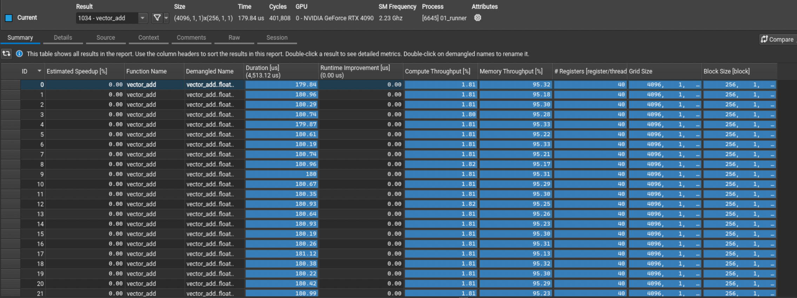

# Vector Addition

### 编译

vecadd 算子太简单，`-O0` 禁用编译器优化后体现不同kernel实现的性能差异。

### 性能数据对比

| Kernel Version | Avg Latency (ms) | Throughput (GB/s) | Compute (GFLOPS) |
| :--- | :--- | :--- | :--- |
| **Naive (__K0)** | 0.2284 | 881.6133 | 73.4678 |
| **Smem (__K1)** | 0.2284 | 881.6133 | 73.4678 |
| **Float4 (__K2)** | 0.2279 | 883.4578 | 73.6215 |
| **GridStride + Float4 (__K3)** | 0.2316 | 869.2197 | 72.4350 |
| **Manual Unroll + GridStride + Float4 (__K4)** | 0.2320 | 867.6435 |72.3036 |

### 分析

**性能无提升，略有波动。**

- K0 Profiling Result:

- K4 Profiling Result:

典型的 memory bound 算子，data 复用率极低，每个elem只访问一次。从profiling结果可以看出，向量化访存kernel（K2,K3,K4）在G2S和S2G时有略微提升。
